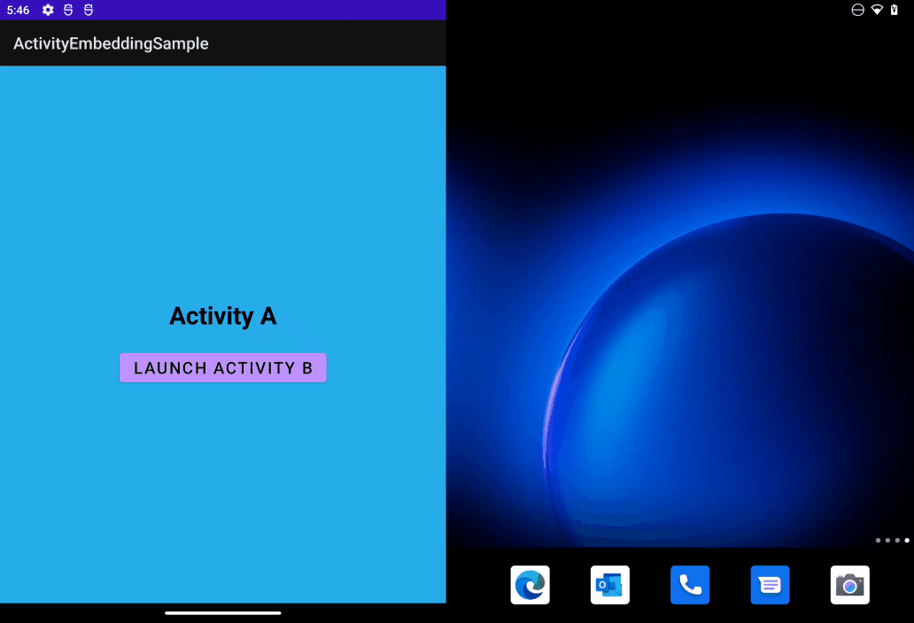
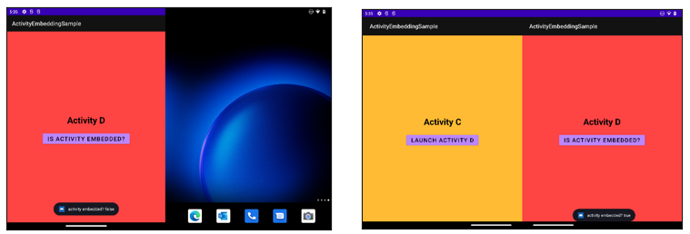

# activity-embedding-sample

With Jetpack Window Manager's **Activity Embedding**, we can define specific rules that define how we want to show the activities in our app when satisfying them.
For example, we could define a rule that whenever there is a specific enough width available, we show two activities side-by-side, or otherwise, stacked one on top of the other.

## Sample app
In this sample app we are going to showcase three features:

- Adding an activity as **placeholder** in a two-pane scenario. This is useful when you need to show two activities side-by-side (e.g., a list with options on the left and the content at the right), but the content is not ready, to help handle that, we can show an activity as a placeholder.

- Show **two activities side-by-side** by defined in its **split rule**. This split action will be explicitly triggered from the source activity.

- We are going to see how to **know whether an activity is running embedded or not**.

## Activity Embedding and Jetpack Window Manager
- [Activity Embedding](https://developer.android.com/reference/androidx/window/layout/FoldingFeature#isSeparating()).
- [Jetpack Window Manager](https://developer.android.com/guide/topics/large-screens/make-apps-fold-aware)

## Code of Conduct
This project has adopted the [Microsoft Open Source Code of Conduct](https://opensource.microsoft.com/codeofconduct/). For more information see the [Code of Conduct FAQ](https://opensource.microsoft.com/codeofconduct/faq/) or contact [opencode@microsoft.com](mailto:opencode@microsoft.com) with any additional questions or comments.

## License
 This code is licensed under [MIT](https://mit-license.org/) Open Source license.
